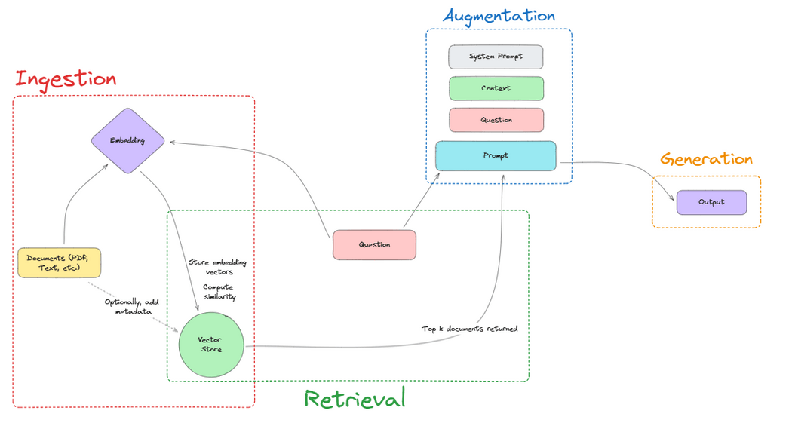

## LangChain: Key Components and Workflow

In this video, we will discuss some **important components** of LangChain that are commonly used to develop **Generative AI (GenAI)** applications.  
We will use the example of a **RAG application** (Retrieval Augmented Generation) to illustrate the process.

---

### What is a RAG Application?

RAG applications allow you to query large datasets (e.g., PDFs, documents) and retrieve answers using **Generative AI models**.

For example:

- A **data source** contains thousands of PDFs.
- A **GenAI application** processes user questions, searches the data source, and provides relevant responses.

---

## Key Steps in Building a RAG Application

### 1. **Data Ingestion**

- The first step involves **loading data** from various data sources:
  - PDF files
  - Excel files
  - JSON files
  - Images
  - Videos
  - URLs

> **Next Video**: Demonstration of **data ingestion techniques** with LangChain.

---

### 2. **Data Transformation (Text Chunking)**

- After loading the data, we **split** it into smaller chunks.
- Splitting the data is important due to **context size limitations** in Language Models (LMs):

  - OpenAI models
  - Google Gemini Pro
  - Open-source models (e.g., LLaMA 3 from Hugging Face)

- **Why is chunking needed?**
  - LMs have a limited context size.
  - Dividing large datasets into **manageable chunks** ensures better querying and responses.

---

### 3. **Text Embedding**

- **Text embedding** converts text data into **vectors**.
- Vectors are essential for similarity-based algorithms (e.g., cosine similarity).

- **Embedding Techniques:**
  - **OpenAI Embeddings**
  - Open-source embeddings (e.g., Hugging Face models)
  - Google Gemini Pro embeddings

> Embeddings enable the application to perform **similarity searches** to identify relevant content.

---

### 4. **Vector Store Database**

- Once the text is converted into vectors, it is stored in a **Vector Store Database**.

- Examples of **Vector Databases**:

  - **Pinecone**
  - **ChromaDB**
  - **Astra DB**

- **Purpose:**
  - Store vectorized data.
  - Query the database to retrieve **contextual information** based on similarity search.

---

## Second Module: Querying the Vector Store

### 5. **Prompt Design**

- A **prompt** guides the LM on how to behave and respond.
- Example:

  > "Act as an AI researcher and answer the user’s questions."

- The **prompt** is combined with the user’s query to generate a response.

---

### 6. **Retrieval Chain**

- The **Retrieval Chain** acts as an interface to query the **Vector Store Database**.
- Steps:
  1. Query the Vector DB.
  2. Retrieve **context information** relevant to the user’s query.
  3. Combine the context with the prompt.
  4. Send it to the LM to generate the output response.

---

## Summary of Steps

1. **Data Ingestion**: Load data from PDFs, images, videos, etc.
2. **Text Chunking**: Split large datasets into manageable chunks.
3. **Text Embedding**: Convert text into vectors using embedding techniques.
4. **Vector Store Database**: Store vector data for retrieval.
5. **Prompt Design**: Combine user queries with prompts.
6. **Retrieval Chain**: Query the vector database and generate responses.

---

## Next Steps

In the upcoming videos, we will:

1. Explore **data ingestion techniques** with LangChain.
2. Demonstrate how to **split data into chunks**.
3. Discuss **embedding techniques** for text data.
4. Learn how to store data in **vector databases**.
5. Implement the **retrieval chain** and create end-to-end RAG applications.

---

## Conclusion

These components are fundamental for building **GenAI applications** with LangChain. Understanding and implementing them step-by-step will help you develop powerful, scalable applications.

Stay tuned for the next video, where we begin with **data ingestion techniques**!
